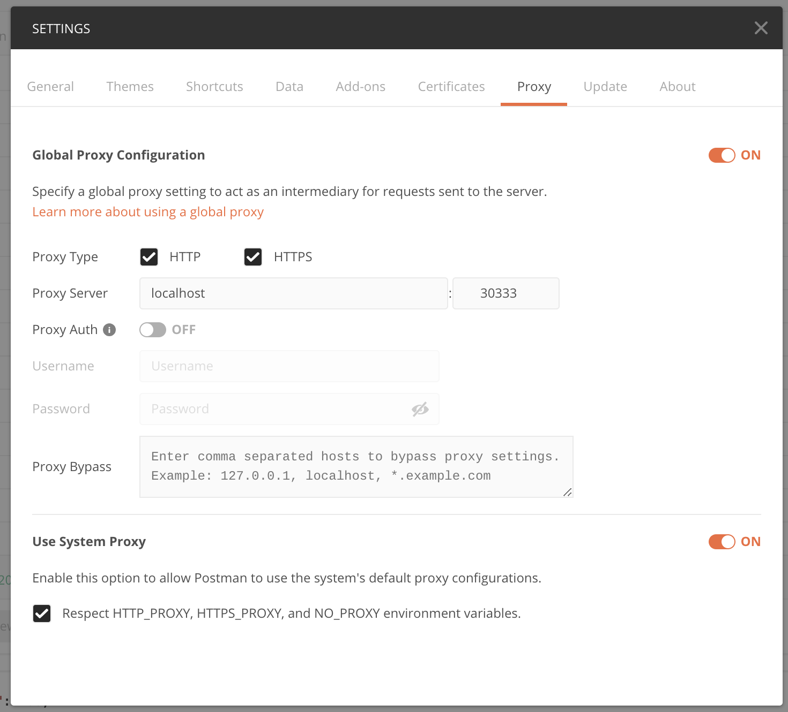
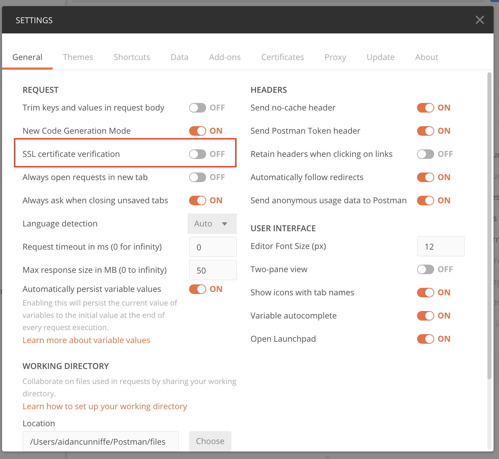

# Document any API in Minutes

Many of us spend hours of our lives creating OpenAPI specifications for APIs. We read the docs, send example requests, and slowly build up a mental model of how a service works. 

Optic's `intercept` mode makes this process much easier. As you explore an API in the browser, Postman or using Curl, Optic watches the requests and learns the API's behavior. This process is probably similar to what you do today, but instead of writing an API specification manually Optic does it for you. 

## Install the Optic CLI

If you have not already installed the Optic CLI, open a terminal window and run the following command: 



```bash
$ yarn add global @useoptic/cli
```



```
$ npm install @useoptic/cli -g
```



## Using with Postman

To start observing an API run the following command with a hostname of the API. You do not need to include a protocol ie `http` or `https`.

```text
# api intercept ${hostname}
api intercept api.twitter.com
```

This will start a proxy server that allows Optic to watch your API's behavior. Just point Postman to this Proxy in `Postman -> Preferences -> Proxy`



You will also need to turn off Postman's SSL Verification so the local Optic proxy can rely traffic even though it has a self-signed certificate. Your API requests / responses will still use SSL and be encrypted in-transit, but the local Optic proxy can now read them. 



## Using with Chrome

If the API you want to document can be exercised through the web browser, use the `--chrome` flag to intercept requests from the Chrome network tab. 

```text
api intercept api.twitter.com --chrome
```

## Creating the API Specification

Once you've collected some sample traffic, go to the browser tab Optic opened to document the API. Documenting an API with intercept mode works the same way as documenting an API in Optic normally. 

Read all about it here: [How to document your API in Optic](https://docs.useoptic.com/documenting-an-api#adding-paths-to-your-spec)

