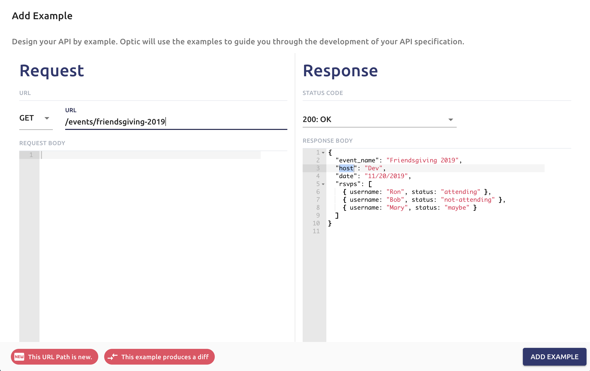

# Designing APIs by Example

For new APIs, a design-first workflow is the way to go. Spending time up-front to design a good API contract and get feedback from consumers usually leads to a higher quality API being built.

Many teams are interested in building new APIs design-first but, it can be a daunting task get started even with popular API description formats like OpenAPI. 

A design-first workflow doesn’t necessarily mean you need to start by learning an API description format. In fact, you can get a lot of the benefits of a design-first workflow without using traditional API descriptions. 

## Benefits of Design-by-Example

* Example requests come from the perspective of the API consumer. This builds empathy with the consumer and forces you to think more about how the API will be used. This makes the process more accessible to designers and product managers and leads to a better API design.
* Using example requests lowers the barrier to entry. Examples are concrete and only depend on a basic knowledge of HTTP and JSON, not the additional levels of abstraction that API description formats require.
* Example requests should align well with scenarios / user stories from your project management process. Often the scenarios get lost in the process of creating the spec, but this way each scenario is documented independently with examples and their relationship is preserved.
* A library of example requests can be turned into a spec, but a spec can’t usually generate meaningful example requests. The examples can then be used for mock data and are guaranteed to adhere to the spec.

## Using Optic to turn examples in an API Spec

Optic makes it easy to input examples requests and responses and use them to build your API spec. 

You can try this out online by [clicking here](https://design.useoptic.com/spec-by-example). ****

**Add an example request/responses on Optic**  
Click **"**Add Example" then input an example request / response 

**Click "Document new API Request"**

**Add the path to your spec**

**Use Optic to document request and response bodies**

That's it! All you have to do is provide Optic with examples of how you want your API to behave and it will build your spec for you. 

Using examples to drive your API design process builds more user empathy and makes getting started more accessible to all stakeholders. If you want to try designing your API with examples consider giving this workflow a try, or book a [free API Consultation with the Optic for help designing your next API.](https://calendly.com/optic-onboarding/api-consultation?month=2019-11)

