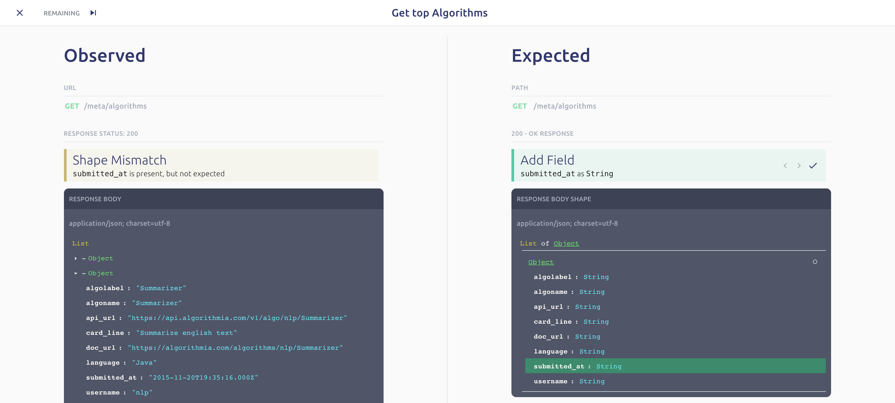

# Detecting API Changes

Every API should have accurate documentation. Even with good processes in place, new features don't always get documented, developers sometimes introduce changes to an API's behavior without realizing it, and breaking changes make it into production. 

Optic gives teams the tools they need to address these common problems leading to:

* API documentation that is always accurate
* The ability to catch unintended changes in your API behavior quickly
* Many of the benefits of contract testing without the investment \(read more about [API Testing](testing/live-contract-testing.md)\)

## Tracking your API's Behavior

While running locally, Optic helps developers understand how their code changes affect the API contract. Optic's development proxy constantly compares the API's actual behavior to how the specification says it is supposed to behave.

When Optic observes undocumented behavior, it logs the invalid request/response, and lets developers know immediately:

```text
[Optic] Undocumented API Behavior Observed. Run 'api spec' to review. 
```




Optic will iterate through the log of invalid requests and give developers several options:

1. **Update the specification** based on one of the interpretations Optic suggests. ie If a new field was observed, you can add that field to the spec. All the developer has to do is click 'Accept' in Optic and the tool will patch the API specification for you with the proper changes. 
2. **Mark the unexpected behavior as a bug.** If you're Optic's team edition, we can set up Optic to post a ticket with the request log and debug information directly to your issue tracker Jira, GitHub, etc. 
3. **Discard the log**. This is useful if you are refactoring or making sweeping changes to your code that puts your code in a work-in-progress state.

With Optic, there's an easy way to keep their API spec and code in sync and catch bugs that break the API contract. 


**Hooks:** In Optic's Team Edition, you can configure various hooks that require developers to handle any unexpected behaviors in Optic before pushing code. 


## Live Contract Testing

In addition to monitoring your APIs during development, Optic can be deployed as a component in your infrastructure or API gateway. You can use this approach in development, staging, or even production; and log every time your API displays undocumented behavior. 

Live contract testing which relies on sampling real transactions for adherence to a spec is becoming a popular approach to contract testing at some of the largest tech companies. You just have to deploy Optic's contract monitoring in your infrastructure, and you get automated contract tests with full coverage of your API's surface area. 

[Read More](testing/live-contract-testing.md)

