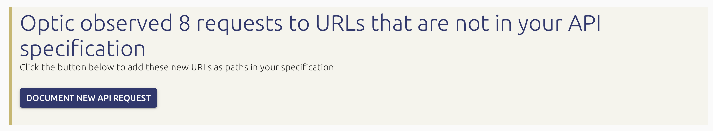
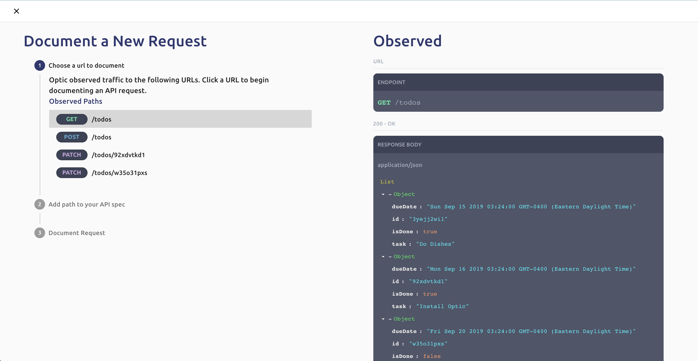
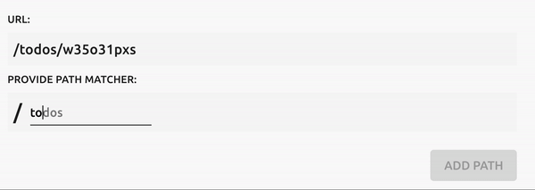
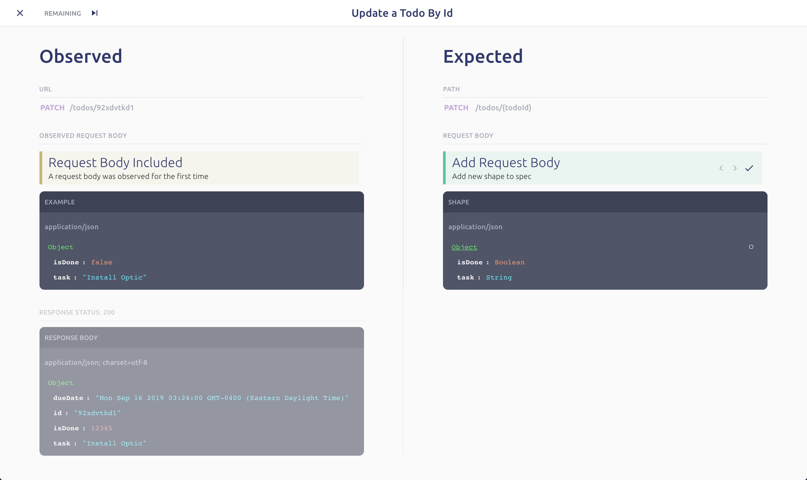
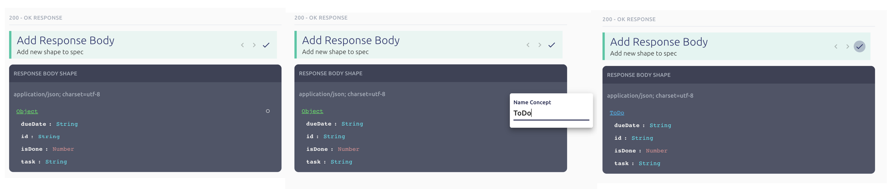
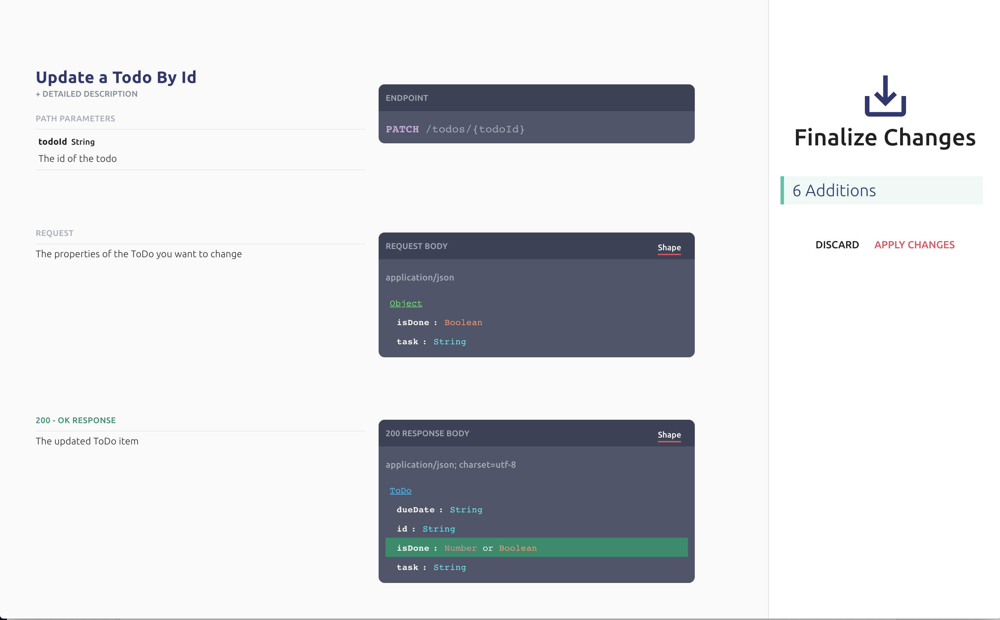

# Documenting your API

## Prerequisites

To get the most out of this tutorial, make sure you either have: 

* An API with Optic integrated. [Click here for docs \(it only takes 5 minutes to setup](./)\)
* OR, the [ToDo API Example](https://design.useoptic.com/example-sessions/todo-example) opened in another tab

## Real traffic → API Documentation


If you're using your own API for this tutorial:  
1. Run **api start**  
2. Hit your API with traffic using your website, Postman, Curl, etc  
3. Stop the server, and run **api spec**  
  
If you're want to use one of our example API the tutorial:  
1. Open the [ToDo API Example](https://design.useoptic.com/example-sessions/todo-example) in another tab


### Unexpected Behavior 

Optic lets you know whenever your API doesn't follow its specification. Because we're starting with an empty specification, everything Optic observes is treated as new -- similar to how every file is new when you add Git to an existing project. 

The first thing you will see in Optic is a card telling you that Optic has observed URLs that are not your API specification. The first thing you will have to do is add paths for these URLs to your specification. 

### Adding Paths to your Spec

Click "Document New API Request" in the card above. This will show you all the undocumented URLs Optic has observed your API handle. You can hover over each URL to see a one of the actual Request = Responses Optic observed. 

When you click on one of the URLs, Optic will ask you to add a corresponding API path to your spec. 


**URL vs Path?**   
An API path describes the location of an operation in the API. It is represented as a URL template which handles all similar URLs.   
For example, these 3 urls...  
- /brand/apple  
- /brand/pepsi  
- /brand/hershey   
  
Would all be matched by this path, where {name} is a path parameter.   
/brand/{name}


To add a path, click on one of the URLs, and start typing, Optic offers autocomplete and visual feedback to help you write the API paths for the observed URL: 

Enter one path component at a time. Optic won't let you proceed until the path you provide matches the URL you selected. 

* Constants in the path should be entered as a normal string ie `todos` or `users`
* Path parameters should be wrapped in `{curly_braces}` or `:have_a_colan_in_front`

### Documenting a Request

Now that Optic knows the path of the request you are documenting, it can compare every Request/Response it observed in your API traffic to the specification. 

This is sort of like running `git diff` but for your API -- Optic calculates the diff between an observed request/response \(always on the left\) and the spec \(on the right\). 

<table>
  <thead>
    <tr>
      <th style="text-align:left">Observed (Left Pane)</th>
      <th style="text-align:left">Expected (Right Pane)</th>
    </tr>
  </thead>
  <tbody>
    <tr>
      <td style="text-align:left">
        
Displays an actual observation of your API&apos;s behavior.

        

      </td>
      <td style="text-align:left">Displays the relevant subset of your API specification based on the context
        of the observation.</td>
    </tr>
    <tr>
      <td style="text-align:left"><b>Diff Card</b> -- highlights the difference between the request and response
        that was observed.</td>
      <td style="text-align:left">
        
<b>Interpretation Card </b>-- Provides options for updating your specification
          based to compensate for the diff.

        

      </td>
    </tr>
  </tbody>
</table>

#### The Diff Workflow Explained 

* **Observation** - An observation is real request/response to your API that Optic observed recently
* **Ordering** - While there can be multiple diffs for a single observation, each diff is presented to the user one at a time. 
* **Diff** - A single difference between an observation and the spec. ie "a field is missing" or "field 'name' is a number instead of a string"
* **Interpretations -** A way of interpreting the diff, represented by a compensating action the user can take to modify the spec. ie "Make field optional" or "Change 'birthday' from String to Date". There can be multiple interpretations for any diff that you can stage before choosing to accept. 

#### Naming Shared Shapes

As you work through documenting your API for the first time -- you'll likely encounter the same shapes being used multiple times across your API. Optic makes it simple to name these shapes -- just click the dot to the right of any `object` while you're working through an API diff. 


After you name a shape in Optic, that shape will be recognized and reused automatically throughout your API spec. For instance, if we named the above shape `ToDo` , later on Optic would automatically label an array containing `ToDo` items as a `List of ToDos`  
  
Because Optic uses these shared shapes when learning your API, It's better to name them as early as possible. 


### Finalizing the Spec

Optic shows you a summary of the changes you've made to your API spec and allows you to apply them to your actual API. Behind the scenes Optic makes the necessary updates to your specification so you don't have to learn OpenAPI or another API description format. 

## Conclusion 

That's it -- you just found the fastest way to accurately document your API and you didn't have to learn OpenAPI or another API description format to get the job done. 

Next we'll show you how Optic helps update your spec whenever the API changes. 

