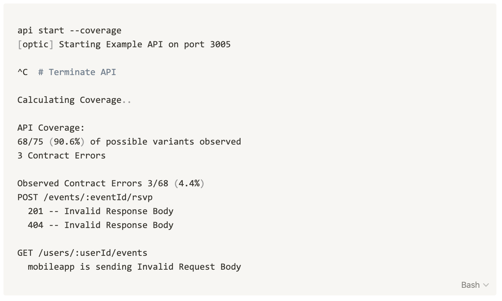

# Live Contract Testing

One of the hardest parts of building an API is making sure that what you build follows that contract you have defined. 

### Why API Testing is Hard

Testing APIs is traditionally done by running requests against the API server and making assertions about the responses.

Ideally, these requests:

* Fully exercise the surface area of the API \(every endpoint is tested, with examples that yield every possible status code\).
* Can replayed over and over again. This usually requires a separate testing environment which can be quite expensive.
* Do not include sensitive data

In practice, it is quite difficult to manually curate a suite of test requests that meet these requirements and achieve good coverage of your API's surface area. 

### Live Contract Testing - A Simple Alternative

Many teams are starting to invest in live contract testing. With live testing, there's no need to manually curate test cases. Instead, teams collect samples from their development and staging environments and run OpenAPI validators on the requests/responses their APIs handle. Whenever an endpoint behaves in an expected way, the request, response and other information needed to debug it are automatically logged.

This has several distinct advantages:

* Test data is 'real' and more representative of production traffic
* One time investment. Once you setup the environment to log discrepancies between the contract and real behavior, you get contract testing for free.
* No separate test environment or additional resources \(mock databases + mock integrations\) are needed.

If your APIs handle a reasonable amount of traffic while in development/staging, live contract testing makes a lot of sense. The downside of course is that you move your testing from build time to pre-deploy, but if you have good controls around CI and multiple environments that's less of a concern.

### API Coverage

The major challenge with live testing is false positives. Just because you haven't seen any discrepancies between the API's behavior and its specification doesn't mean the API has been fully tested.

* Were there 1000 requests to endpoint A, B and C, but none to endpoint D?
* Was every possible status code observed for each endpoint?
* Was every instance of polymorphism in the spec been observed?

With Optic's API Coverage tooling, live testing goes from being a cool idea to a practical and pragmatic replacement for manual contract testing.

API Coverage:

* Allows teams to focus their manually written tests towards less exercised parts of the spec. Instead of writing 150 tests that cover 85% of the spec, write 10 that cover the 15% that is less exercised in development/staging.
* Gives teams the confidence that their API conforms to the API spec in all cases. Doing this manually would be very costly to write and maintain.
* Frees developers from writing contract tests and lets them focus on testing the functional /  business requirements

In Optic, API coverage is measured by our development proxy. As traffic passes through the proxy, Optic heat-maps the traffic against the specification. Just start your API with the -_-coverage_ flag. When you reach 100% coverage, and no contract errors, you can have confidence that the API follows the contract. 


**Pre Release** -- This feature is only available in the developer-preview builds. It will be included in the open source version soon.  


### Using Optic for Live Contract Testing

Optic compares your API's behavior to how your API spec says it is supposed to behave. This ability, and the API Coverage report, makes it a natural fit for any team that is considering live testing. 


You can think of Optic's approach to live contract testing as a distributed version of Optic's local development proxy. Instead of watching an API locally while an individual developer is using it, a distributed approach aggregates the log of unexpected behavior from multiple live instances of your API into one API diff w/ a coverage report. 


To do live contract testing, you will need to deploy Optic's contract monitoring to you development or staging environments so it can watch the behavior of your APIs. Today we have plugins for the following tools:

* Kong
* AWS API Gateway
* Apigee
* Envoy
* Azure API Gateway
* Docker
* NGINX

If you're interested in live contract testing, book a demo here:



