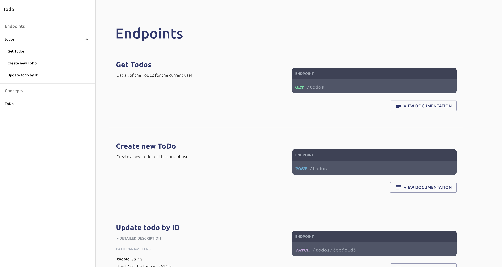
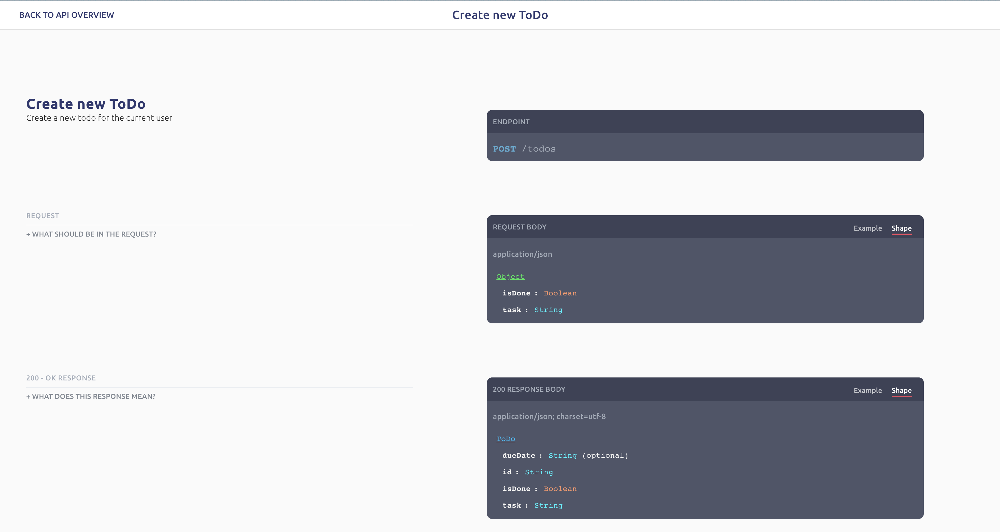
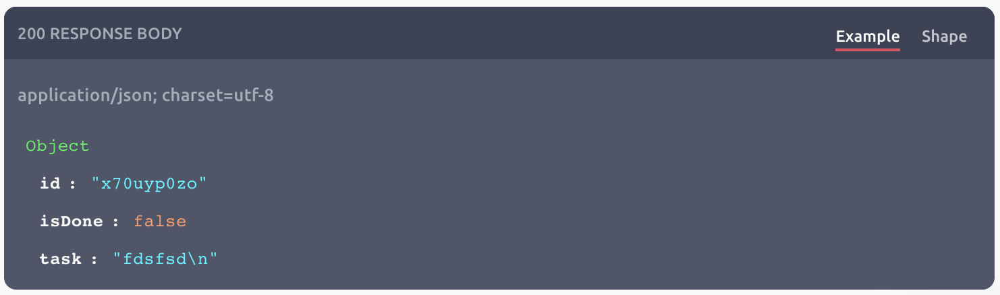
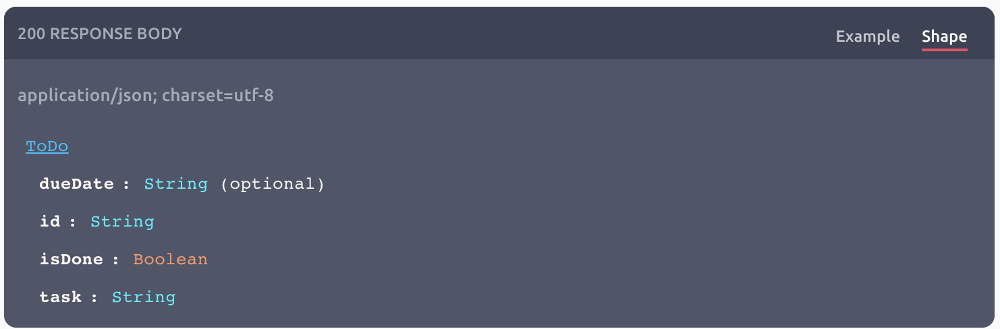
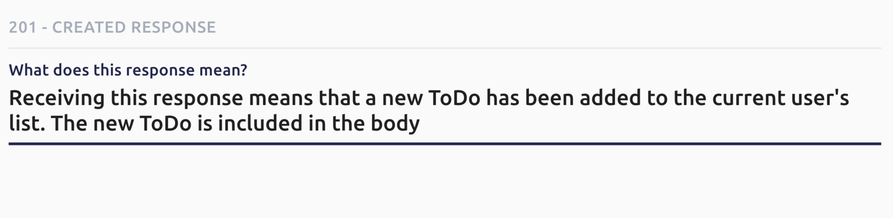

# Viewing API Documentation

## Overview

Optic has a Stripe-inspired docs viewer built-in. To open these docs, just run the following command from your API's root directory. 

```text
api spec
```

The docs will open in the web browser:



The documentation is organized around the Endpoint and Concepts in your API. You can scroll through a high-level overview of your API, and expand any of these sections for more information. 



### Automated Examples

It's hard enough to keep an API specification up-to-date manually -- if you also want to store examples the problem gets even harder. 

Optic automatically maintain a bank of example usages in your API docs. When your API contract gets updated in Optic, it replaces the examples it saved with ones that follow the new spec. 

Throughout the docs, Optic makes it easy to switch between the example and the shape:





### What is Automated vs User-Provided? 

Optic automatically writes and maintains the spec for your API. That saves you time on the tedious work of writing JSON Schema and manually documenting every possible response in your API. 

You can provide additional descriptions for Endpoints, Responses, Shapes, and Fields by clicking on them. These inputs support normal Markdown and never be overwritten by Optic if your API changes. 



### What's Next? 

We've got big plans for the documentation viewer -- stay tuned. 

